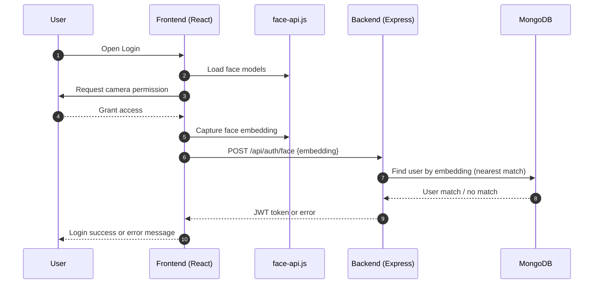

<!--
  Apex LMS — Enhanced README
  Notes:
  - Replace placeholder GIFs in /assets/demo with your own recordings.
  - The CI badge below will become "live" once you push the workflow in /ci.yml.
-->

<p align="center">
  
</p>

<p align="center">
  
</p>

<p align="center">
  <a href="https://github.com/Amanbundela75/LMS-Plateform/actions/workflows/ci.yml"></a>
  <a href="https://opensource.org/licenses/MIT"></a>
  <a href="https://github.com/Amanbundela75/LMS-Plateform/stargazers"></a>
  <a href="https://github.com/Amanbundela75/LMS-Plateform/issues"></a>
  
  
</p>

<p align="center">
  <b>A modern MERN-based Learning Management System that verifies identity with Face ID, showcases a live coding portfolio, and gives administrators powerful control over branches and courses.</b>
</p>

<p align="center">
  <a href="#-live-demo--screenshots">Demo</a> •
  <a href="#-core-features">Features</a> •
  <a href="#-architecture--workflows">Architecture</a> •
  <a href="#-getting-started">Setup</a> •
  <a href="#-how-to-contribute">Contribute</a> •
  <a href="#-license">License</a>
</p>

---

# 🎓 Apex LMS: Secure Biometric Learning & Portfolio Platform

Apex LMS is a modern, full-stack Learning Management System designed to be a student's central hub for their entire academic and professional journey. It features secure biometric face verification for logins, a dynamic professional portfolio tracker, and comprehensive administrative controls.

- Repository: https://github.com/Amanbundela75/LMS-Plateform
- License: MIT
- Stack: React (Vite) • Node.js • Express • MongoDB • face-api.js

---

## ✨ Why This Project?

In today's competitive world, a student's profile is more than just grades. Apex LMS was built to address this by:

1. Enhancing Security: Robust biometric verification eliminates password fraud and unauthorized access.
2. Centralizing Professional Growth: Unified tracking of courses, coding stats, projects, and achievements.
3. Bridging Academia and Industry: Mentors and university reps get real-time insight and can guide effectively.

---

## 🚀 Live Demo & Screenshots

[🚀 Live Demo — Coming Soon]

Below are placeholders — replace with your own GIFs in assets/demo (see docs/ASSETS_GUIDE.md):

| Face Recognition Login | Student Portfolio Dashboard | Admin Course Management |
| :--------------------: | :-------------------------: | :---------------------: |
|  |  |  |

<details>
  <summary>See more demos</summary>
  <br/>
  
  
</details>

---

## 🌟 Core Features

### 👨‍🎓 For Students
- Secure Biometric Authentication
  - Face ID Registration to create a unique biometric template.
  - Real-time Face Login for accurate and secure access.
  - Intelligent Error Handling for mismatches, no face detected, etc.
- Dynamic Professional Portfolio
  - Live Coding Stats Sync (LeetCode, GFG, etc.).
  - GitHub-style Activity Heatmap to visualize daily progress.
  - Achievement & Badge Showcase from multiple platforms.
- Academic & Project Dashboard
  - Card-based overview for semester, CGPA, SGPA.
  - Project Showcase with status and GitHub links.
- Personalized Learning Path
  - Curated courses per academic branch with one-click enrollment.

### 👮 For Administrators
- Secure Admin Dashboard with protected routes.
- Comprehensive User Management with filtering and pagination.
- Full CRUD
  - Branch Management (e.g., Mechanical, Electronics).
  - Course Management with descriptions and branch assignment.
- Enrollment Oversight across courses and students.

---

## 🛠️ Tech Stack & Architecture

- Frontend: React (Vite), React Router, Context API, face-api.js, Axios, Chart.js, React Calendar Heatmap
- Backend: Node.js, Express.js, MongoDB, Mongoose, JWT, bcrypt.js, express-validator, Multer
- DevOps: GitHub Actions CI, Prettier

### Architecture at a Glance

```mermaid
flowchart LR
  A[Browser (React + Vite)] --> B[face-api.js Models]
  A -->|JWT| C[REST API (Express)]
  C --> D[(MongoDB)]
  C -->|Images/Uploads| E[Multer Storage]
  A --> F[3rd Party Stats APIs\n(LeetCode/GFG/GitHub)]
  subgraph Frontend
    A
    B
  end
  subgraph Backend
    C
    E
  end
  D:::db
classDef db fill:#F5F3FF,stroke:#A78BFA,stroke-width:1px;
```

### Face Login Workflow



---

## ⚙️ Continuous Integration (Moving Workflow)

This repository includes a multi-node CI that:
- Installs dependencies for both frontend and backend
- Runs tests, builds, and linting (when scripts are available)
- Caches node_modules for faster builds

The live status badge at the top updates on every push and pull request.

CI workflow file: .github/workflows/ci.yml

---

## 🚀 Getting Started

### Prerequisites
- Node.js (v18+ recommended)
- npm (v9+) or yarn
- MongoDB (local or Atlas)
- Git

### Installation & Setup

1) Clone the Repository
```bash
git clone https://github.com/Amanbundela75/LMS-Plateform.git
cd LMS-Plateform
```

2) Backend Setup
```bash
cd backend
npm install
```

Create backend/.env:
```env
PORT=5001
MONGO_URI=YOUR_MONGODB_CONNECTION_STRING
JWT_SECRET=YOUR_SUPER_SECRET_JWT_KEY_OF_32_CHARACTERS
```

- Face Recognition Models: Ensure face-api.js models are available (e.g., public/models or a models directory you load from).
- Start backend:
```bash
npm start
```
Server: http://localhost:5001

3) Frontend Setup
```bash
cd ../frontend
npm install
npm run dev
```
Vite proxies /api to http://localhost:5001 by default.
App: http://localhost:5173

### Initial Admin User Setup

1) Register a new user (with face verification)
2) Promote to Admin
   - Open MongoDB (Atlas UI, Compass, or mongosh)
   - users collection → your user → set role: "admin"
3) Login as Admin to access admin routes

---

## 🧩 Tips for Great Demos (Animated)

- Add your GIFs to assets/demo and update the paths above.
- Keep each GIF under ~6–10 MB for fast loading.
- Recommended tools: ScreenToGif (Windows), Kap (macOS), Peek (Linux), or ffmpeg.
- See docs/ASSETS_GUIDE.md for detailed steps.

---

## 🗺️ Roadmap

- [ ] Add OTP fallback for biometric login
- [ ] WebAuthn passkeys integration
- [ ] Real-time notifications (Socket.io)
- [ ] Public student portfolio links
- [ ] Role-based analytics dashboard

---

## 🤝 How to Contribute

1) Fork
2) Create a feature branch: git checkout -b feat/amazing
3) Commit: git commit -m "feat: add amazing feature"
4) Push: git push origin feat/amazing
5) Open a Pull Request

---

## 📝 License

MIT © 2025 Aman Bundela — See LICENSE for details.

---

## 🧑‍💻 Author

- Aman Bundela
- GitHub: @Amanbundela75
- Project: https://github.com/Amanbundela75/LMS-Plateform
